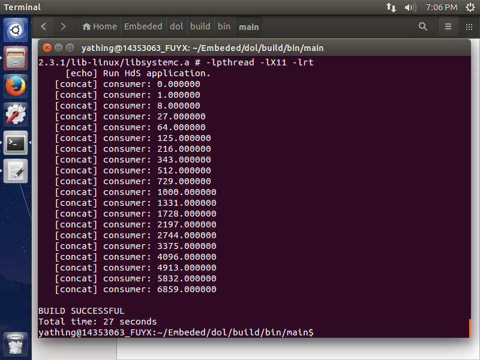
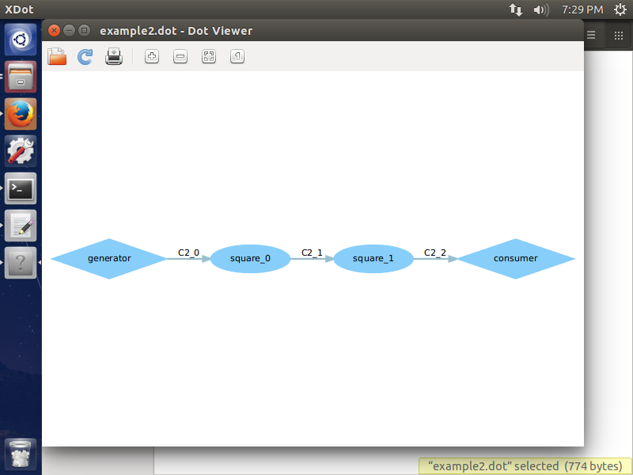
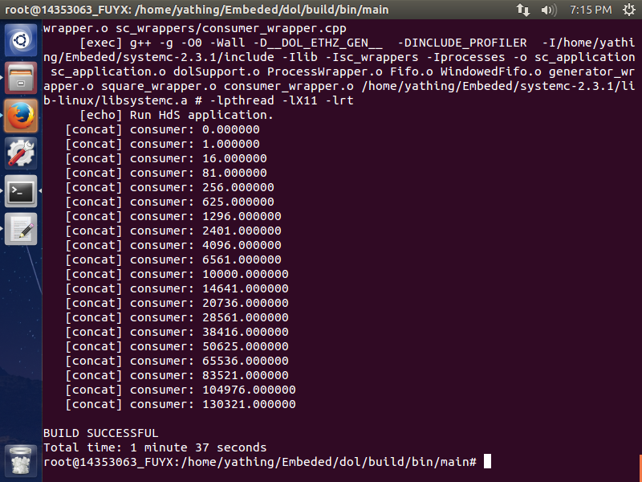

#DOL实例分析与编程
Studen_ID: 14353063		Name:傅一馨

##一、实验内容
#### (1) 修改example1，使其输出三次方数
　　通过理解代码框架可得，初始的example1的运行过程是：
　　首先generator连续向输出链路发送20个数（0到19），而square中则接收这个数，进行处理后再次通过输出端发送出去，最后由consumer接收并在terminal中输出。

　　那么为了输出三次方数，我们需要修改对generator传来数的具体处理代码。于是，首先查看square.c代码：

	int square_fire(DOLProcess *p) {
	    float i;
	    if (p->local->index < p->local->len) {
	        DOL_read((void*)PORT_IN, &i, sizeof(float), p);
	        i = i*i;
	        DOL_write((void*)PORT_OUT, &(i), sizeof(float), p);
	        p->local->index++;
	    }
	    if (p->local->index >= p->local->len) {
	        DOL_detach(p);
	        return -1;
	    }
    	return 0;
	}

　　从代码中可以看到，square首通过DOLread得到i，然后使i成为二次方数再通过DOLwirte输出。于是，我就将`  i = i × i   `修改为`i = i × i × i `，重新编译运行即可输出从0到19的三次方数。

####(2) 修改example2，使其3个square模块变为2个

　　example的结构框架定义在其xml文件里。

　　首先定义了一个常数N，值为3: `<variable value="3" name="N"/>`

　　在xml文件里，使用了iterator，通过迭代来构建square的布局。

① 定义N个square，每个square具有一个输入端口(0)，一个输出端口(1)：
	
	<iterator variable="i" range="N">
		<process name="square">
			<append function="i"/>
			<port type="input" name="0"/>
			<port type="output" name="1"/>
			<source type="c" location="square.c"/>
		</process>
	</iterator>

② 定义连线，由于有N个square，则有N+1条连线。每条连线有一个输入口，一个输出口：

	<iterator variable="i" range="N + 1">
		<sw_channel type="fifo" size="10" name="C2">
			<append function="i"/>
			<port type="input" name="0"/>
			<port type="output" name="1"/>
		</sw_channel>
	</iterator>

③ 定义具体连接端口。设定每条连线与square的具体连接方式。

	<iterator variable="i" range="N">
		<connection name="to_square">
			<append function="i"/>
			<origin name="C2"><append function="i"/><port name="1"/></origin>
			<target name="square"><append function="i"/><port name="0"/></target>
		</connection>
		
		<connection name="from_square">
			<append function="i"/>
			<origin name="square"><append function="i"/>
			<port name="1"/></origin>
			<target name="C2"><append function="i + 1"/>
			<port name="0"/></target>
		</connection>
	</iterator>

　　综合上述，N控制了所有迭代的次数，于是最简单的修改办法就是将N的value从3修改为2。

##二、实验结果
####(1)运行结果如下：
　　如下图所示，生成并输出了从0到19的三次方数。

####(2)重新编译运行完成后得到如下图所示dot图：

　　修改得到的dot如下图所示：

　　每一个square对generator生成数字的处理是平方再传输，于是当square数目有原来的三个减少到两个，所以输出的数字由原来的i^8减少到i^4,即最后会输出从0到19的四次方数。

##三、实验感想
####(1)实验中遇到的问题
　　刚开始改完代码后，直接在terminal中运行`sudo ant -f runexample.xml -Dnumber=N`语句，但是得到的结果与未改代码时运行的结果是一样的。刚开始以为是代码修改错误，还在不停的换修改方式；后来尝试将square.c文件修改为无法正常编译的文件（即删去所有下括号），发现terminal中仍然可以正常运行。推测原因是相当于没有重新编译而是直接运行了之前的结果。所以解决方式是进入root权限，通过语句`rm -rf MyFileName`删除build文件，然后重新编译运行即可得到正确结果。
####(2)心得感想
　　本次实验中，学习了dol的实例代码与框架分析。

　　example.xml文件定义了模块连接。其中，process代表了generator、square和consumer等模块，而sw_channel表示了连接的线，connection则是具体定义了process和swchannel的连接方式。

　　在src文件夹里则有模块的代码功能定义。每个模块的c文件中有init和fire两个函数，init是对模块进行初始化定义，只会被执行一次，这个函数可以不写，在example1中，init函数就是初始化了数组下标；而fire函数是指模块工作时的具体工作内容，会被调用多次。比如在example1中，generator生成数传给square，square从输入端口读入一个数，将其平方处理，并把结果通过输出端口传输给consumer，由consumer进行输出。

　　通过本次实验，熟悉了dol文件的编写方法，进一步加深了对其的理解。受益匪浅

