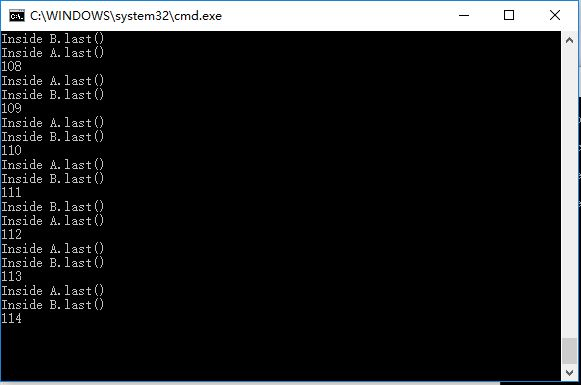

#DeadLock
Studen_ID: 14353063		Name:傅一馨

##一、实验内容
#### (1)基本代码
　　首先构建A和B两个基础类。可以看到，A的methodA中调用了B的last函数（输出B），而B的methodB中调用了A的last函数（输出A）。且因为这里使用了synchronized，每次在某时刻最多只有一个线程执行该段代码，保证了线程的单步执行。举例说如果线程1正在调用MethodA，而线程2想要这四个函数中的任何一个，则只能等到线程1结束调用。

		class A{
			synchronized void methodA(B b){
				b.last();
			}
			synchronized void last(){
				System.out.println("Inside A.last()");	
			}
		}
		class B{
			synchronized void methodB(A a){
				a.last();
			}
			synchronized void last(){
				System.out.println("Inside B.last()");	
			}
		
		}

　　这里则是主要执行函数。首先main函数执行，调用了Deadlock函数，同时AB两个类建立，然后开始执行Deadlock函数里的内容，A通过methodA调用了B的函数，而B通过methodB调用了A的函数。以此循环。

		class Deadlock implements Runnable{
			A a = new A();
			B b = new B();
			Deadlock(){
				Thread t = new Thread(this);
				int count = 20000;	
				t.start();
				while(count-->0);
				a.methodA(b);
			}
			
			public void run(){
				b.methodB(a);
			}
			public static void main(String args[]){
				new Deadlock();	
			}
		}

##二、实验结果
####(1)运行结果如下：

　　如下图所示，当运行到第114次时，发生死锁，bat文件停止运行。此时count为20000。

　　如下图所示，当运行到第93次时，发生死锁，bat文件停止运行。此时count为2000。

##三、实验结果哟分析
#### 1. 产生死锁的四个必要条件
死锁就是两个或者多个进程，互相请求对方占有的资源。

　① 互斥条件：一个资源每次只能被一个进程使用

　② 请求与保持条件：一个进程因请求资源而阻塞时，对已获得的资源保持不放

　③ 不剥夺条件:进程已获得的资源，在末使用完之前，不能强行剥夺

　④ 循环等待条件:若干进程之间形成一种头尾相接的循环等待资源关系

#### 2. 上述程序产生死锁的原因

　① 由于定义AB类时synchronized的设定，可以保证线程每次只能占用一个函数资源，互斥条件达成。

　② 如果线程1已经调用了MethodA，又想要请求B的last，这是如果线程2调用了MethodB，线程1就会被阻塞，但线程1因为没有成功调用B的last，已占有的MethodA则无法释放，满足请求与保持条件。

　③ 从代码中可以看出没有任何抢占资源的指令，所以不剥夺条件成立。

　④ 在多线程环境下，线程1调用MethodA，紧接着请求调用B的last；线程2调用MethodB，又想要调用A的last。即一个线程锁定了一个资源A，而又想去锁定资源B；在另一个线程中，锁定了资源B，而又想去锁定资源A以完成自身的操作，两个线程都想得到对方的资源，而不愿释放自己的资源，造成两个线程都在等待，而无法执行的情况。即产生循环等待。
